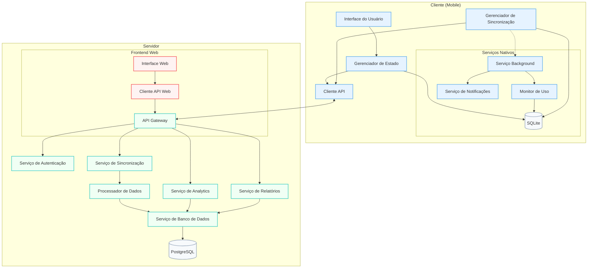
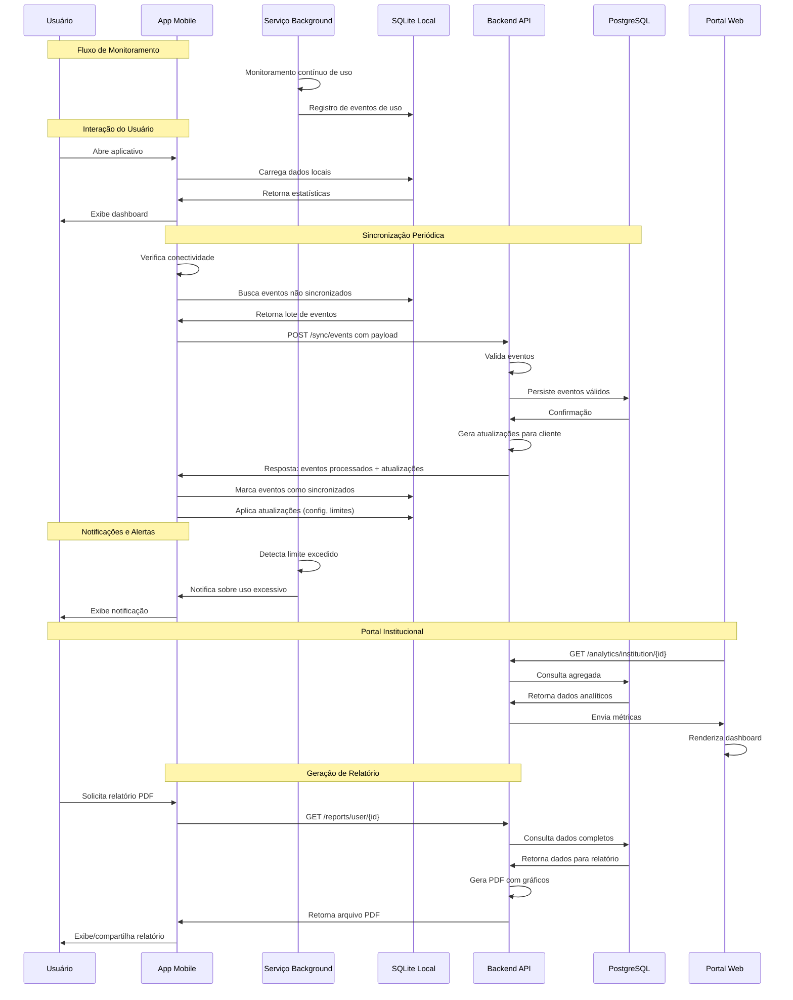
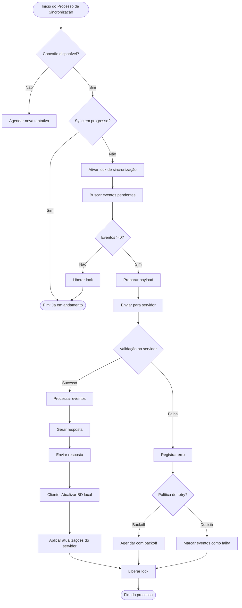

# Conexão Saudável

[](https://deepwiki.com/Conexao-Saudavel/app-conexao-saudavel)

Aplicativo mobile voltado ao controle da dependência digital entre estudantes universitários. A aplicação contará com um app que será usado pelo usuário final para ajuda-lo no dia-a-dia com a redução do seu tempo de tela e permitirá que o usuário tenha uma forma de acompanhar suas melhorias. 
O app contará com um banco local para armazenar os dados localmente quando offline e assim que possível realizar a sincronização dos dados com o servidor remoto para que a instituição que controla o uso do app pelo usuário final possa ter acesso aos dados e assim tomar decisões a respeito do acompanhamento do usuário.

## Diagrama de Contexto



## Diagrama do fluxo de dados




## Diagrama do processo de sincronização detalhado



## 

## 🚀 Tecnologias

- Node.js
- TypeScript
- Express
- TypeORM
- PostgreSQL
- SQLite
- React Native
- Jest
- ESLint
- Prettier
- Winston (Logging)

## 📋 Pré-requisitos

- Node.js 18+
- PostgreSQL 14+
- npm ou yarn

## 🔧 Instalação

1. Clone o repositório:
```bash
git clone https://github.com/Conexao-Saudavel/app-conexao-saudavel.git
cd conexao-saudavel
```

2. Instale as dependências:
```bash
npm install
```

3. Configure as variáveis de ambiente:
```bash
cp .env.example .env
```
Edite o arquivo `.env` com suas configurações.

4. Execute as migrações do banco de dados:
```bash
npm run migration:run
```

## 🚀 Executando o projeto

### Desenvolvimento
```bash
npm run dev
```

### Produção
```bash
npm run build
npm start
```

## 🧪 Testes

```bash
# Executa todos os testes
npm test

# Executa os testes com cobertura
npm test -- --coverage
```

## 📦 Scripts Disponíveis

- `npm run dev`: Inicia o servidor em modo desenvolvimento
- `npm run build`: Compila o projeto
- `npm start`: Inicia o servidor em modo produção
- `npm test`: Executa os testes
- `npm run lint`: Verifica o código com ESLint
- `npm run lint:fix`: Corrige problemas de linting
- `npm run format`: Formata o código com Prettier
- `npm run migration:generate`: Gera uma nova migração
- `npm run migration:run`: Executa as migrações pendentes
- `npm run migration:revert`: Reverte a última migração

## 📁 Estrutura do Projeto

```
app-repo
├──assets
│   ├──AppIcons
│   │   ├──android
│   │   │   ├──mipmap-hdpi
│   │   │   │   └──conexao-saudavel-sloth.png
│   │   │   ├──mipmap-mdpi
│   │   │   │   └──conexao-saudavel-sloth.png
│   │   │   ├──mipmap-xhdpi
│   │   │   │   └──conexao-saudavel-sloth.png
│   │   │   ├──mipmap-xxhdpi
│   │   │   │   └──conexao-saudavel-sloth.png
│   │   │   └──mipmap-xxxhdpi
│   │   │   │   └──conexao-saudavel-sloth.png
│   │   ├──Assets.xcassets
│   │   │   └──AppIcon.appiconset
│   │   │   │   └──Contents.json
│   │   ├──appstore.png
│   │   └──playstore.png
│   ├──adaptive-icon.png
│   ├──favicon.png
│   ├──icon.png
│   ├──instagram.png
│   ├──logo-sem-fundo.png
│   ├──splash-icon.png
│   ├──splash.png
│   ├──spotify.png
│   ├──tiktok.png
│   ├──twitter.png
│   └──youtube.png
├──src
│   ├──components
│   │   ├──auth
│   │   │   ├──ForgotPasswordForm.tsx
│   │   │   ├──RegistrationForm.tsx
│   │   │   └──TermsCheckbox.tsx
│   │   ├──common
│   │   │   ├──Button.tsx
│   │   │   ├──InputField.tsx
│   │   │   ├──ScreenWrapper.tsx
│   │   │   └──Typography.tsx
│   │   ├──forms
│   │   │   └──.gitkeep
│   │   └──layout
│   │   │   └──.gitkeep
│   ├──error
│   │   ├──components
│   │   │   └──.gitkeep
│   │   ├──constants
│   │   │   └──.gitkeep
│   │   ├──handlers
│   │   │   └──.gitkeep
│   │   ├──types
│   │   │   └──.gitkeep
│   │   └──utils
│   │   │   └──.gitkeep
│   ├──hooks
│   │   └──.gitkeep
│   ├──mocks
│   │   └──emptyModule.js
│   ├──navigation
│   │   ├──AuthNavigator.tsx
│   │   └──MainNavigator.tsx
│   ├──screens
│   │   ├──auth
│   │   │   ├──ForgotPasswordScreen.tsx
│   │   │   ├──LoginScreen.tsx
│   │   │   └──RegisterScreen.tsx
│   │   ├──dashboard
│   │   │   ├──DashboardScreen.tsx
│   │   │   ├──ReflectiveDiaryScreen.tsx
│   │   │   ├──UsageChartsScreen.tsx
│   │   │   └──UsageGoalScreen.tsx
│   │   ├──profile
│   │   │   └──.gitkeep
│   │   └──settings
│   │   │   └──.gitkeep
│   ├──services
│   │   ├──api
│   │   │   ├──authService.ts
│   │   │   └──client.ts
│   │   ├──background
│   │   │   └──.gitkeep
│   │   └──storage
│   │   │   └──.gitkeep
│   ├──store
│   │   └──slices
│   │   │   └──.gitkeep
│   ├──theme
│   │   ├──colors.ts
│   │   └──paperTheme.ts
│   ├──types
│   │   ├──auth.ts
│   │   └──common.ts
│   └──utils
│   │   └──.gitkeep
├──app.json
├──App.tsx
├──babel.config.js
├──index.ts
├──LICENSE
├──package-lock.json
├──package.json
├──railway.toml
├──README.md
├──tsconfig.json
└──.gitignore
```

## 📝 Logging

O projeto utiliza Winston para gerenciamento de logs com as seguintes características:

### Níveis de Log
- error: Erros críticos
- warn: Avisos importantes
- info: Informações gerais
- http: Requisições HTTP
- debug: Informações de debug

### Destinos de Log
- Console (colorido)
- Arquivo de erros (`logs/error.log`)
- Arquivo de todos os logs (`logs/all.log`)

### Uso do Logger
```typescript
import { logError, logInfo, logWarning, logDebug, logHttp } from './utils/logger';

// Exemplo de uso
logInfo('Operação concluída', { userId: '123' });
logError(new Error('Erro de autenticação'), 'AuthService');
```

## 🤝 Contribuindo

1. Faça um fork do projeto
2. Crie uma branch para sua feature (`git checkout -b feature/AmazingFeature`)
3. Commit suas mudanças (`git commit -m 'Add some AmazingFeature'`)
4. Push para a branch (`git push origin feature/AmazingFeature`)
5. Abra um Pull Request

## 📝 Licença

Este projeto está sob a licença GLPv3. Veja o arquivo [LICENSE](LICENSE) para mais detalhes.
