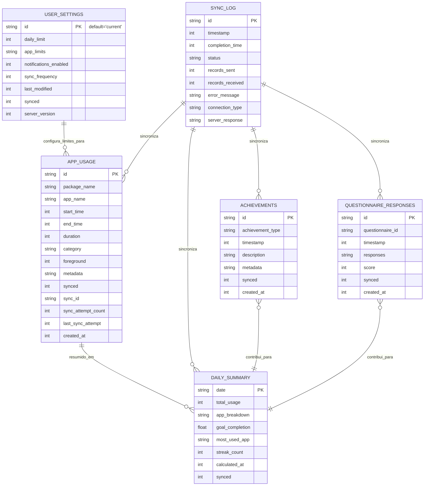
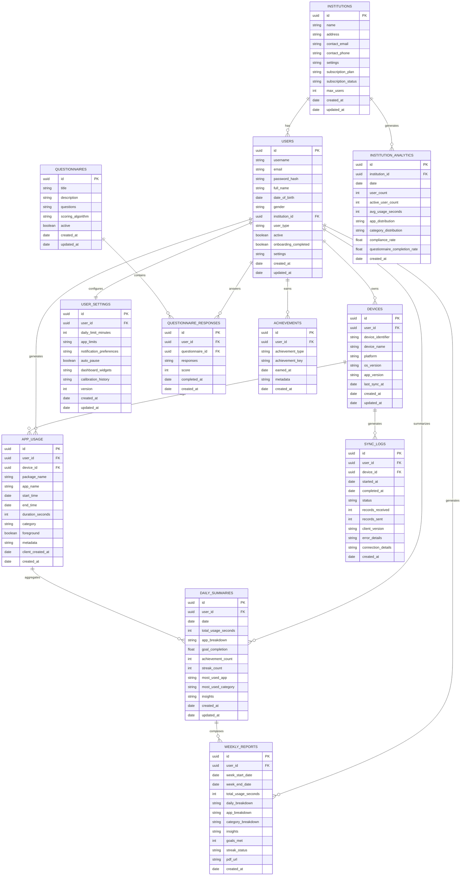
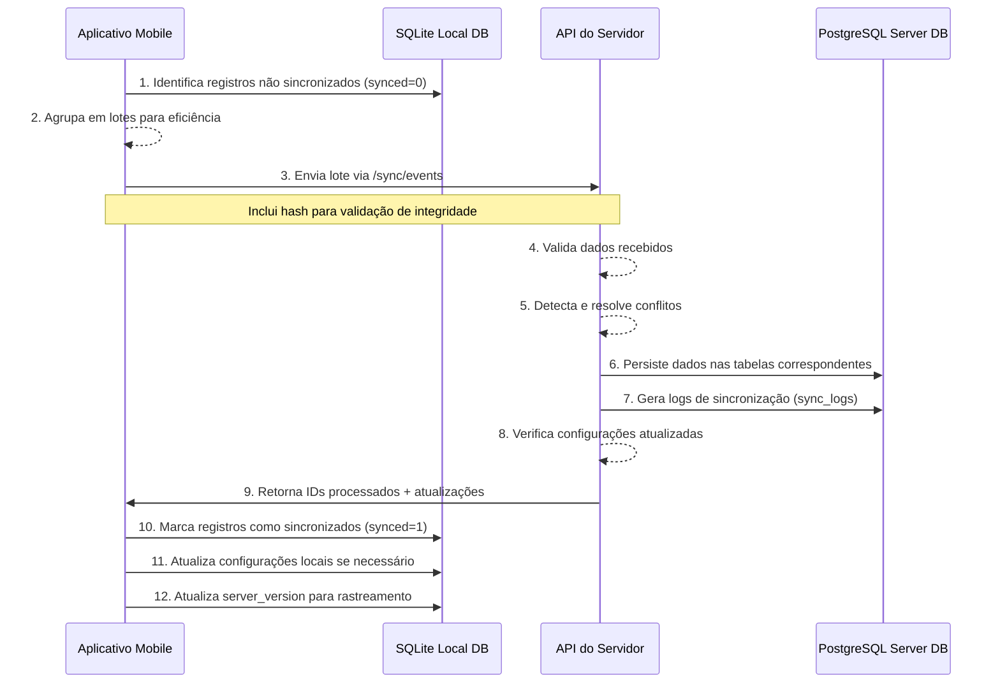

2025-05-05 09:59

Status: #nova

Tags: [[Conexão Saudável - Base de Dados]], [[Conexão Saudável - Revisão do Projeto (v2)]], [[Conexão Saudável]]


# Título: Conexão Saudável - Banco de Dados v2.0

## Sumário

1. [Introdução](#1-introdução)
2. [Banco de Dados Local (SQLite)](#2-banco-de-dados-local-sqlite)
3. [Banco de Dados do Servidor (PostgreSQL)](#3-banco-de-dados-do-servidor-postgresql)
4. [Mecanismos de Sincronização e Interação](#4-mecanismos-de-sincronização-e-interação)
5. [Considerações de Performance e Segurança](#5-considerações-de-performance-e-segurança)
6. [Diagramas](#6-diagramas)

---

## 1. Introdução

Este documento detalha a estrutura de armazenamento de dados do projeto Conexão Saudável V2.0, abrangendo tanto o banco de dados local do aplicativo móvel (SQLite) quanto o banco de dados do servidor (PostgreSQL). A arquitetura de dados foi projetada para suportar os requisitos-chave do sistema:

- Monitoramento contínuo do uso de aplicativos
- Funcionamento offline com sincronização periódica
- Geração de relatórios e análises
- Manutenção da privacidade e segurança dos dados

A abordagem de banco de dados distribuído, com armazenamento local no dispositivo e consolidação no servidor, permite que o aplicativo funcione de maneira independente mesmo sem conectividade, sincronizando dados quando a conexão estiver disponível.
  
---
## 2. Banco de Dados Local (SQLite)

O banco de dados local utiliza SQLite, escolhido por sua leveza, confiabilidade e suporte nativo em dispositivos móveis. A estrutura foi projetada para minimizar o espaço ocupado enquanto maximiza a performance em operações frequentes.

### 2.1 Tabelas Principais

#### 2.1.1 Tabela: `app_usage`

Principal tabela de armazenamento de eventos de uso de aplicativos.

```sql

CREATE TABLE app_usage (

  id TEXT PRIMARY KEY,                -- UUID gerado localmente

  package_name TEXT NOT NULL,         -- Identificador do aplicativo

  app_name TEXT,                      -- Nome amigável do aplicativo

  start_time INTEGER NOT NULL,        -- Timestamp de início (ms desde epoch)

  end_time INTEGER,                   -- Timestamp de fim (pode ser null para sessões em andamento)

  duration INTEGER,                   -- Duração em segundos (calculada)

  category TEXT,                      -- Categoria do aplicativo

  foreground INTEGER DEFAULT 1,       -- Flag: 1=uso em primeiro plano, 0=background

  metadata TEXT,                      -- JSON com metadados adicionais

  synced INTEGER DEFAULT 0,           -- Flag: 0=não sincronizado, 1=sincronizado

  sync_id TEXT,                       -- ID de referência da sincronização no servidor

  sync_attempt_count INTEGER DEFAULT 0, -- Contador de tentativas de sincronização

  last_sync_attempt INTEGER,          -- Timestamp da última tentativa

  created_at INTEGER NOT NULL         -- Timestamp de criação do registro

);

  

-- Índices para otimização de consultas frequentes

CREATE INDEX idx_app_usage_synced ON app_usage(synced);

CREATE INDEX idx_app_usage_package ON app_usage(package_name);

CREATE INDEX idx_app_usage_timerange ON app_usage(start_time, end_time);

```

#### 2.1.2 Tabela: `user_settings`

Armazena configurações do usuário e limites de uso.

```sql

CREATE TABLE user_settings (

  id TEXT PRIMARY KEY DEFAULT 'current',  -- Usa 'current' como ID fixo para configuração atual

  daily_limit INTEGER,                    -- Limite diário em minutos

  app_limits TEXT,                        -- JSON com limites por aplicativo

  notifications_enabled INTEGER DEFAULT 1,-- Flag para notificações

  sync_frequency INTEGER DEFAULT 60,      -- Frequência de sincronização em minutos

  last_modified INTEGER NOT NULL,         -- Timestamp da última modificação

  synced INTEGER DEFAULT 0,               -- Flag de sincronização

  server_version INTEGER DEFAULT 0        -- Versão no servidor para resolução de conflitos

);

```

#### 2.1.3 Tabela: `sync_log`

Registra o histórico de sincronizações.

```sql

CREATE TABLE sync_log (

  id TEXT PRIMARY KEY,                -- UUID da operação de sincronização

  timestamp INTEGER NOT NULL,         -- Timestamp de início

  completion_time INTEGER,            -- Timestamp de conclusão

  status TEXT NOT NULL,               -- 'success', 'failed', 'partial'

  records_sent INTEGER DEFAULT 0,     -- Quantidade de registros enviados

  records_received INTEGER DEFAULT 0, -- Quantidade de registros recebidos

  error_message TEXT,                 -- Mensagem de erro (se houver)

  connection_type TEXT,               -- Tipo de conexão (wifi, cellular)

  server_response TEXT                -- JSON com resposta completa do servidor

);

```

#### 2.1.4 Tabela: `questionnaire_responses`

Armazena respostas a questionários de bem-estar.

```sql

CREATE TABLE questionnaire_responses (

  id TEXT PRIMARY KEY,                -- UUID do registro

  questionnaire_id TEXT NOT NULL,     -- Identificador do questionário

  timestamp INTEGER NOT NULL,         -- Timestamp de preenchimento

  responses TEXT NOT NULL,            -- JSON com as respostas

  score INTEGER,                      -- Pontuação calculada (se aplicável)

  synced INTEGER DEFAULT 0,           -- Flag de sincronização

  created_at INTEGER NOT NULL         -- Timestamp de criação

);

```

#### 2.1.5 Tabela: `daily_summary`

Armazena resumos diários pré-calculados para performance.

```sql

CREATE TABLE daily_summary (

  date TEXT PRIMARY KEY,              -- Data no formato YYYY-MM-DD

  total_usage INTEGER,                -- Tempo total em segundos

  app_breakdown TEXT,                 -- JSON com uso por aplicativo

  goal_completion REAL,               -- Porcentagem de cumprimento da meta (0-100)

  most_used_app TEXT,                 -- App mais usado do dia

  streak_count INTEGER,               -- Dias consecutivos de meta alcançada

  calculated_at INTEGER NOT NULL,     -- Timestamp do cálculo

  synced INTEGER DEFAULT 0            -- Flag de sincronização

);

```

#### 2.1.6 Tabela: `achievements`

Armazena conquistas do usuário.

```sql

CREATE TABLE achievements (

  id TEXT PRIMARY KEY,                -- UUID da conquista

  achievement_type TEXT NOT NULL,     -- Tipo de conquista

  timestamp INTEGER NOT NULL,         -- Timestamp da conquista

  description TEXT,                   -- Descrição detalhada

  metadata TEXT,                      -- JSON com metadados adicionais

  synced INTEGER DEFAULT 0,           -- Flag de sincronização

  created_at INTEGER NOT NULL         -- Timestamp de criação

);

```

### 2.2 Relações e Índices Adicionais

```sql

-- Índice composto para consultas de uso não sincronizado

CREATE INDEX idx_app_usage_pending_sync ON app_usage(synced, created_at)

WHERE synced = 0;

  

-- Índice para consultas de resumo por período

CREATE INDEX idx_daily_summary_date_range ON daily_summary(date);

  

-- Índice para questionários pendentes de sincronização

CREATE INDEX idx_questionnaire_pending ON questionnaire_responses(synced)

WHERE synced = 0;

```

### 2.3 Triggers

```sql

-- Trigger para calcular duração automaticamente

CREATE TRIGGER calculate_duration

AFTER UPDATE OF end_time ON app_usage

FOR EACH ROW

WHEN NEW.end_time IS NOT NULL AND NEW.duration IS NULL

BEGIN

  UPDATE app_usage

  SET duration = (NEW.end_time - NEW.start_time) / 1000

  WHERE id = NEW.id;

END;

  

-- Trigger para atualizar last_modified em user_settings

CREATE TRIGGER update_settings_timestamp

BEFORE UPDATE ON user_settings

BEGIN

  UPDATE user_settings

  SET last_modified = (strftime('%s', 'now') * 1000)

  WHERE id = OLD.id;

END;

```

---

## 3. Banco de Dados do Servidor (PostgreSQL)

O banco de dados do servidor utiliza PostgreSQL, escolhido por sua robustez, capacidade de lidar com consultas complexas e suporte a tipos de dados avançados como JSONB.

### 3.1 Tabelas Principais

#### 3.1.1 Tabela: `users`

Armazena informações dos usuários.

```sql

CREATE TABLE users (

  id UUID PRIMARY KEY,

  username VARCHAR(255) NOT NULL UNIQUE,

  email VARCHAR(255) UNIQUE,

  password_hash VARCHAR(255) NOT NULL,

  full_name VARCHAR(255),

  date_of_birth DATE,

  gender VARCHAR(50),

  institution_id UUID REFERENCES institutions(id),

  user_type VARCHAR(50) NOT NULL,  -- 'student', 'teacher', 'parent', 'admin'

  active BOOLEAN DEFAULT TRUE,

  onboarding_completed BOOLEAN DEFAULT FALSE,

  settings JSONB DEFAULT '{}',

  created_at TIMESTAMP WITH TIME ZONE DEFAULT NOW(),

  updated_at TIMESTAMP WITH TIME ZONE DEFAULT NOW()

);

  

CREATE INDEX idx_users_institution ON users(institution_id);

CREATE INDEX idx_users_user_type ON users(user_type);

```

#### 3.1.2 Tabela: `institutions`

Armazena informações das instituições.

```sql

CREATE TABLE institutions (

  id UUID PRIMARY KEY,

  name VARCHAR(255) NOT NULL,

  address TEXT,

  contact_email VARCHAR(255),

  contact_phone VARCHAR(50),

  settings JSONB DEFAULT '{}',

  subscription_plan VARCHAR(50),

  subscription_status VARCHAR(50),

  max_users INTEGER,

  created_at TIMESTAMP WITH TIME ZONE DEFAULT NOW(),

  updated_at TIMESTAMP WITH TIME ZONE DEFAULT NOW()

);

```

#### 3.1.3 Tabela: `devices`

Registro de dispositivos por usuário.

```sql

CREATE TABLE devices (

  id UUID PRIMARY KEY,

  user_id UUID NOT NULL REFERENCES users(id),

  device_identifier VARCHAR(255) NOT NULL,

  device_name VARCHAR(255),

  platform VARCHAR(50) NOT NULL,  -- 'android', 'ios'

  os_version VARCHAR(50),

  app_version VARCHAR(50),

  last_sync_at TIMESTAMP WITH TIME ZONE,

  created_at TIMESTAMP WITH TIME ZONE DEFAULT NOW(),

  updated_at TIMESTAMP WITH TIME ZONE DEFAULT NOW(),

  UNIQUE(user_id, device_identifier)

);

  

CREATE INDEX idx_devices_user ON devices(user_id);

```

#### 3.1.4 Tabela: `app_usage`

Armazenamento consolidado de uso de aplicativos.

```sql

CREATE TABLE app_usage (

  id UUID PRIMARY KEY,

  user_id UUID NOT NULL REFERENCES users(id),

  device_id UUID NOT NULL REFERENCES devices(id),

  package_name VARCHAR(255) NOT NULL,

  app_name VARCHAR(255),

  start_time TIMESTAMP WITH TIME ZONE NOT NULL,

  end_time TIMESTAMP WITH TIME ZONE,

  duration_seconds INTEGER,

  category VARCHAR(100),

  foreground BOOLEAN DEFAULT TRUE,

  metadata JSONB,

  client_created_at TIMESTAMP WITH TIME ZONE,

  created_at TIMESTAMP WITH TIME ZONE DEFAULT NOW()

);

  

CREATE INDEX idx_app_usage_user_id ON app_usage(user_id);

CREATE INDEX idx_app_usage_timerange ON app_usage(start_time, end_time);

CREATE INDEX idx_app_usage_package ON app_usage(package_name);

```

#### 3.1.5 Tabela: `daily_summaries`

Resumos diários de uso por usuário.

```sql

CREATE TABLE daily_summaries (

  id UUID PRIMARY KEY,

  user_id UUID NOT NULL REFERENCES users(id),

  date DATE NOT NULL,

  total_usage_seconds INTEGER NOT NULL,

  app_breakdown JSONB NOT NULL,

  goal_completion NUMERIC(5,2),

  achievement_count INTEGER DEFAULT 0,

  streak_count INTEGER DEFAULT 0,

  most_used_app VARCHAR(255),

  most_used_category VARCHAR(100),

  insights JSONB,

  created_at TIMESTAMP WITH TIME ZONE DEFAULT NOW(),

  updated_at TIMESTAMP WITH TIME ZONE DEFAULT NOW(),

  UNIQUE(user_id, date)

);

  

CREATE INDEX idx_daily_summaries_user_date ON daily_summaries(user_id, date);

```

#### 3.1.6 Tabela: `user_settings`

Configurações e preferências de usuário.

```sql

CREATE TABLE user_settings (

  id UUID PRIMARY KEY,

  user_id UUID NOT NULL REFERENCES users(id) UNIQUE,

  daily_limit_minutes INTEGER,

  app_limits JSONB DEFAULT '{}',

  notification_preferences JSONB DEFAULT '{}',

  auto_pause BOOLEAN DEFAULT FALSE,

  dashboard_widgets JSONB DEFAULT '[]',

  calibration_history JSONB DEFAULT '[]',

  version INTEGER NOT NULL DEFAULT 1,

  created_at TIMESTAMP WITH TIME ZONE DEFAULT NOW(),

  updated_at TIMESTAMP WITH TIME ZONE DEFAULT NOW()

);

  

CREATE INDEX idx_user_settings_user ON user_settings(user_id);

```

#### 3.1.7 Tabela: `questionnaire_responses`

Respostas de questionários de bem-estar.

```sql

CREATE TABLE questionnaire_responses (

  id UUID PRIMARY KEY,

  user_id UUID NOT NULL REFERENCES users(id),

  questionnaire_id UUID NOT NULL REFERENCES questionnaires(id),

  responses JSONB NOT NULL,

  score INTEGER,

  completed_at TIMESTAMP WITH TIME ZONE NOT NULL,

  created_at TIMESTAMP WITH TIME ZONE DEFAULT NOW()

);

  

CREATE INDEX idx_questionnaire_responses_user ON questionnaire_responses(user_id);

CREATE INDEX idx_questionnaire_responses_date ON questionnaire_responses(completed_at);

```

#### 3.1.8 Tabela: `questionnaires`

Definições de questionários.

```sql

CREATE TABLE questionnaires (

  id UUID PRIMARY KEY,

  title VARCHAR(255) NOT NULL,

  description TEXT,

  questions JSONB NOT NULL,

  scoring_algorithm VARCHAR(100),

  active BOOLEAN DEFAULT TRUE,

  created_at TIMESTAMP WITH TIME ZONE DEFAULT NOW(),

  updated_at TIMESTAMP WITH TIME ZONE DEFAULT NOW()

);

```

#### 3.1.9 Tabela: `achievements`

Conquistas dos usuários.

```sql

CREATE TABLE achievements (

  id UUID PRIMARY KEY,

  user_id UUID NOT NULL REFERENCES users(id),

  achievement_type VARCHAR(100) NOT NULL,

  achievement_key VARCHAR(100) NOT NULL,

  earned_at TIMESTAMP WITH TIME ZONE NOT NULL,

  metadata JSONB,

  created_at TIMESTAMP WITH TIME ZONE DEFAULT NOW(),

  UNIQUE(user_id, achievement_key)

);

  

CREATE INDEX idx_achievements_user ON achievements(user_id);

```

#### 3.1.10 Tabela: `sync_logs`

Registro de sincronizações.

```sql

CREATE TABLE sync_logs (

  id UUID PRIMARY KEY,

  user_id UUID NOT NULL REFERENCES users(id),

  device_id UUID NOT NULL REFERENCES devices(id),

  started_at TIMESTAMP WITH TIME ZONE NOT NULL,

  completed_at TIMESTAMP WITH TIME ZONE,

  status VARCHAR(50) NOT NULL,

  records_received INTEGER DEFAULT 0,

  records_sent INTEGER DEFAULT 0,

  client_version VARCHAR(50),

  error_details TEXT,

  connection_details JSONB,

  created_at TIMESTAMP WITH TIME ZONE DEFAULT NOW()

);

  

CREATE INDEX idx_sync_logs_user ON sync_logs(user_id);

CREATE INDEX idx_sync_logs_status ON sync_logs(status);

CREATE INDEX idx_sync_logs_date ON sync_logs(started_at);

```

### 3.2 Tabelas de Agregação e Análise

#### 3.2.1 Tabela: `weekly_reports`

Relatórios semanais pré-calculados.

```sql

CREATE TABLE weekly_reports (

  id UUID PRIMARY KEY,

  user_id UUID NOT NULL REFERENCES users(id),

  week_start_date DATE NOT NULL,

  week_end_date DATE NOT NULL,

  total_usage_seconds INTEGER NOT NULL,

  daily_breakdown JSONB NOT NULL,

  app_breakdown JSONB NOT NULL,

  category_breakdown JSONB NOT NULL,

  insights JSONB,

  goals_met INTEGER DEFAULT 0,

  streak_status JSONB,

  pdf_url VARCHAR(255),

  created_at TIMESTAMP WITH TIME ZONE DEFAULT NOW(),

  UNIQUE(user_id, week_start_date)

);

  

CREATE INDEX idx_weekly_reports_user_date ON weekly_reports(user_id, week_start_date);

```

#### 3.2.2 Tabela: `institution_analytics`

Agregações a nível institucional.

```sql

CREATE TABLE institution_analytics (

  id UUID PRIMARY KEY,

  institution_id UUID NOT NULL REFERENCES institutions(id),

  date DATE NOT NULL,

  user_count INTEGER NOT NULL,

  active_user_count INTEGER NOT NULL,

  avg_usage_seconds INTEGER NOT NULL,

  app_distribution JSONB NOT NULL,

  category_distribution JSONB NOT NULL,

  compliance_rate NUMERIC(5,2),

  questionnaire_completion_rate NUMERIC(5,2),

  created_at TIMESTAMP WITH TIME ZONE DEFAULT NOW(),

  UNIQUE(institution_id, date)

);

  

CREATE INDEX idx_institution_analytics_date ON institution_analytics(institution_id, date);

```

### 3.3 Visões e Materialized Views

```sql

-- Visão para facilitar relatórios diários

CREATE VIEW v_user_daily_usage AS

SELECT

  u.id as user_id,

  u.username,

  u.full_name,

  u.institution_id,

  ds.date,

  ds.total_usage_seconds,

  ds.goal_completion,

  ds.streak_count,

  ds.most_used_app,

  ds.app_breakdown

FROM users u

JOIN daily_summaries ds ON u.id = ds.user_id;

  

-- Materialized view para análise de tendências (atualizada diariamente)

CREATE MATERIALIZED VIEW mv_usage_trends AS

SELECT

  user_id,

  date_trunc('week', date) as week,

  avg(total_usage_seconds) as avg_daily_usage,

  array_agg(DISTINCT most_used_app) as common_apps,

  avg(goal_completion) as avg_goal_completion

FROM daily_summaries

GROUP BY user_id, date_trunc('week', date);

  

CREATE INDEX idx_mv_usage_trends_user ON mv_usage_trends(user_id);

```

---

## 4. Mecanismos de Sincronização e Interação

A interação entre o banco de dados local e o servidor é gerenciada através de mecanismos de sincronização robustos que garantem consistência mesmo em casos de conectividade intermitente.

### 4.1 Fluxo de Sincronização

#### 4.1.1 Upload de Dados (Cliente → Servidor)

1. **Preparação:**
   - O cliente identifica registros marcados como `synced = 0`
   - Os registros são agrupados em lotes para otimização de rede
   - Atributos de dispositivo e timestamp são adicionados ao payload
2. **Envio:**
   - O cliente envia o lote via endpoint `/sync/events`
   - Inclui hash de verificação para validação de integridade
3. **Processamento no Servidor:**
   - O servidor valida os dados recebidos
   - Detecta e resolve possíveis conflitos
   - Persiste os dados nas tabelas correspondentes
   - Gera logs de sincronização
4. **Confirmação:**
   - O servidor retorna IDs de registros processados com sucesso
   - O cliente marca esses registros como `synced = 1` e salva o `sync_id`

#### 4.1.2 Download de Configurações (Servidor → Cliente)

1. **Solicitação:**
   - Como parte da resposta de sincronização, o servidor detecta atualizações pendentes
   - Configurações atualizadas como limites de uso são incluídas na resposta
1. **Aplicação:**
   - O cliente atualiza a tabela `user_settings` local
   - Atualiza o `server_version` para rastreamento
   
### 4.2 Resolução de Conflitos

A estratégia de resolução de conflitos segue os seguintes princípios:

1. **Timestamp mais recente vence:**
   - Em conflitos simples, o registro com timestamp mais recente é considerado válido
2. **Servidor tem precedência:**
   - Em caso de empate ou conflito complexo, a versão do servidor prevalece
3. **Mesclagem de campos não conflitantes:**
   - Quando possível, campos que não estão em conflito são mesclados
4. **Versionamento com contador monotônico:**
   - Configurações críticas usam um contador de versão que só aumenta

```typescript

// Exemplo pseudo-código para resolução de conflitos

function resolveConflicts(serverRecord, clientRecord) {

  // Se versões são diferentes e servidor é mais recente

  if (serverRecord.version > clientRecord.version) {

    return serverRecord;

  }

  // Se versões são iguais, verificar timestamps

  if (serverRecord.version === clientRecord.version) {

    if (serverRecord.updated_at >= clientRecord.last_modified) {

      return serverRecord;

    } else {

      // Incrementar versão do cliente e aceitar mudanças

      return {

        ...clientRecord,

        version: clientRecord.version + 1

      };

    }

  }

  // Se o cliente tem versão mais recente (situação anômala)

  if (clientRecord.version > serverRecord.version) {

    // Validar e aceitar com cautela (pode indicar manipulação)

    logAnomaly(serverRecord, clientRecord);

    return validateAndSanitize(clientRecord);

  }

}

```

### 4.3 Política de Retry e Backoff

Para lidar com falhas de comunicação, o sistema implementa uma política de retry com backoff exponencial:


```typescript

// Exemplo pseudo-código para política de retry

async function syncWithRetry() {

  const MAX_RETRIES = 5;

  const BASE_DELAY = 1000; // 1 segundo

  let attempt = 0;

  while (attempt < MAX_RETRIES) {

    try {

      const result = await performSync();

      return result;

    } catch (error) {

      attempt++;

      if (attempt >= MAX_RETRIES) {

        logFailure(error);

        throw error;

      }

      // Backoff exponencial com jitter

      const delay = BASE_DELAY * Math.pow(2, attempt) + Math.random() * 1000;

      await sleep(delay);

    }

  }

}

```

---
## 5. Considerações de Performance e Segurança

### 5.1 Otimizações de Performance

#### 5.1.1 Banco de Dados Local

- **Índices seletivos:**
  - Índices focados em padrões de consulta mais frequentes
  - Índices parciais para consultas específicas
- **Estratégia de limpeza:**
  - Remoção periódica de registros antigos já sincronizados
  - Compactação periódica do banco de dados
- **Consultas otimizadas:**
  - Utilização de transações para operações em lote
  - Pre-agregação de dados em tabelas de resumo
#### 5.1.2 Banco de Dados do Servidor

- **Particionamento:**
  - Particionamento da tabela `app_usage` por mês
  - Particionamento por usuário para grandes instituições
- **Indexação avançada:**
  - Índices em colunas de junção frequente
  - Índices em JSONB para campos consultados frequentemente
- **Materialized Views:**
  - Pré-cálculo de agregações complexas
  - Atualização programada em horários de baixo uso

### 5.2 Considerações de Segurança

#### 5.2.1 Proteção de Dados Local

- **Criptografia em repouso:**
  - Banco SQLite criptografado com chave derivada da autenticação
  - Dados sensíveis armazenados em secure storage nativo
- **Isolamento:**
  - Arquivo de banco de dados em diretório privado do aplicativo
  - Backup automático desabilitado para dados sensíveis
 
#### 5.2.2 Proteção de Dados no Servidor

- **Criptografia em repouso:**
  - Volumes criptografados para armazenamento PostgreSQL
  - Campos sensíveis criptografados a nível de aplicação
- **Acesso granular:**
  - Políticas de segurança a nível de linha (RLS)
  - Esquema de permissões por função de usuário
- **Auditoria:**
  - Logging de operações críticas
  - Detecção de anomalias em padrões de acesso

---
## 6. Diagramas

## 6.1 Diagrama ER - Banco de Dados Mobile (SQLite)

  



### Entidades e Atributos

#### 1. **APP_USAGE**

Registra eventos de uso de aplicativos no dispositivo.

- `id`: Identificador único do registro.
- `package_name` / `app_name`: Identificadores técnicos e legíveis do app.
- `start_time`, `end_time`, `duration`: Tempo de uso (em segundos ou milissegundos).
- `category`: Categoria atribuída ao app (ex: “social”, “produtividade”).
- `foreground`: Indica se o app estava em uso ativo (1) ou em segundo plano (0).
- `metadata`: Informações adicionais em formato de string serializada (ex: localização, contexto).
- `synced`: Flag booleana (0/1) indicando se o registro foi sincronizado.
- `sync_id`, `sync_attempt_count`, `last_sync_attempt`: Controle de sincronização.
- `created_at`: Timestamp da criação local do registro.

Relacionamentos:

- Está resumido em `DAILY_SUMMARY`.
- Pode ser afetado pelas configurações definidas em `USER_SETTINGS`.
- É sincronizado por `SYNC_LOG`.
#### 2. **USER_SETTINGS**

Contém preferências definidas pelo usuário para limitar ou controlar o uso.

- `id`: Chave primária, com valor fixo ('current'), indicando que existe apenas uma instância ativa.
- `daily_limit`: Tempo máximo permitido de uso diário.
- `app_limits`: Limites personalizados por aplicativo (armazenados como string serializada ou JSON).
- `notifications_enabled`: Indica se notificações estão ativadas.
- `sync_frequency`: Intervalo de tempo entre sincronizações.
- `last_modified`: Timestamp da última modificação.
- `synced`: Flag de sincronização.
- `server_version`: Número da versão registrada no servidor.

Relacionamentos:

- Define limites que impactam registros em `APP_USAGE`.

### 3. **SYNC_LOG**

Registra o histórico de tentativas de sincronização com o servidor.

- `id`: Identificador único do log.
- `timestamp`: Início da tentativa de sincronização.
- `completion_time`: Duração da sincronização.
- `status`: Resultado final (ex: "success", "failed").
- `records_sent`, `records_received`: Quantidade de registros trocados.
- `error_message`: Mensagem de erro, se houver.
- `connection_type`: Tipo de rede usada (ex: Wi-Fi, 4G).
- `server_response`: Conteúdo da resposta do servidor.

Relacionamentos:

- Sincroniza dados de `APP_USAGE`, `QUESTIONNAIRE_RESPONSES`, `DAILY_SUMMARY`, e `ACHIEVEMENTS`.

### 4. **QUESTIONNAIRE_RESPONSES**

Contém as respostas dos usuários a questionários sobre bem-estar, comportamento ou outros temas.

- `id`: Identificador da resposta.
- `questionnaire_id`: Identificador do questionário aplicado.
- `timestamp`: Momento da resposta.
- `responses`: Conteúdo das respostas (serializado).
- `score`: Pontuação calculada com base nas respostas.
- `synced`: Indica se foi sincronizado.
- `created_at`: Data/hora da criação local do registro.

Relacionamentos:

- Contribui para `DAILY_SUMMARY`.
- Sincronizado por `SYNC_LOG`.

### 5. **DAILY_SUMMARY**

Representa o resumo diário do uso de aplicativos e desempenho do usuário.

- `date`: Chave primária, no formato de data (ex: "2025-05-05").
- `total_usage`: Total de tempo de uso no dia.
- `app_breakdown`: Detalhamento por aplicativo.
- `goal_completion`: Percentual de cumprimento da meta diária.
- `most_used_app`: Nome do aplicativo mais usado.
- `streak_count`: Número de dias consecutivos com metas cumpridas.
- `calculated_at`: Timestamp de geração do resumo.
- `synced`: Flag de sincronização.

Relacionamentos:

- Resume registros de `APP_USAGE`.
- Recebe contribuições de `ACHIEVEMENTS` e `QUESTIONNAIRE_RESPONSES`.
- É sincronizado por `SYNC_LOG`.

### 6. **ACHIEVEMENTS**

Representa conquistas obtidas pelo usuário com base em metas ou hábitos.

- `id`: Identificador da conquista.
- `achievement_type`: Tipo da conquista (ex: “daily_limit_met”).
- `timestamp`: Quando foi obtida.
- `description`: Texto explicativo.
- `metadata`: Dados adicionais.
- `synced`: Status de sincronização.
- `created_at`: Timestamp de criação local.

Relacionamentos:

- Contribui para o `DAILY_SUMMARY`.
- Sincronizado por `SYNC_LOG`.

## Relacionamentos e Semântica

| Entidade A              | Relação                | Entidade B              | Tipo | Descrição Técnica                                  |
| ----------------------- | ---------------------- | ----------------------- | ---- | -------------------------------------------------- |
| APP_USAGE               | resumido_em            | DAILY_SUMMARY           | N:1  | Eventos de uso alimentam o resumo diário.          |
| USER_SETTINGS           | configura_limites_para | APP_USAGE               | 1:N  | As configurações do usuário impactam os registros. |
| SYNC_LOG                | sincroniza             | APP_USAGE               | 1:N  | Sincroniza dados coletados localmente.             |
| SYNC_LOG                | sincroniza             | QUESTIONNAIRE_RESPONSES | 1:N  | Sincroniza respostas.                              |
| SYNC_LOG                | sincroniza             | DAILY_SUMMARY           | 1:N  | Envia resumos diários.                             |
| SYNC_LOG                | sincroniza             | ACHIEVEMENTS            | 1:N  | Envia conquistas.                                  |
| ACHIEVEMENTS            | contribui_para         | DAILY_SUMMARY           | N:1  | Conquistas são refletidas no resumo diário.        |
| QUESTIONNAIRE_RESPONSES | contribui_para         | DAILY_SUMMARY           | N:1  | Respostas impactam métricas diárias.               |


---

## 6.2 Diagrama ER - Banco de Dados do Servidor (PostgreSQL)

  




### **Entidades e Atributos**

#### 1. **INSTITUTIONS**

Entidades que representam organizações (como escolas, clínicas ou ONGs) que gerenciam usuários.

- `id`: Identificador único.
- `name`, `address`, `contact_email`, `contact_phone`: Informações de contato.
- `settings`: Configurações específicas da instituição.
- `subscription_plan` / `subscription_status`: Informações do plano contratado.
- `max_users`: Limite de usuários suportados.
- `created_at`, `updated_at`: Timestamps de auditoria.

**Relacionamento:**

- `INSTITUTIONS` possui vários `USERS`.
- Gera registros de `INSTITUTION_ANALYTICS`.
#### 2. **USERS**

Indivíduos monitorados pelo sistema, podendo ser adolescentes, pacientes ou membros de uma organização.

- Atributos como `username`, `email`, `full_name`, `gender`, `date_of_birth`, etc.
- `institution_id`: FK para `INSTITUTIONS`.
- `user_type`: Ex: "standard", "admin", etc.
- `onboarding_completed`, `settings`: Status e configurações personalizadas.

**Relacionamentos:**

- Possui vários `DEVICES`.
- Gera `APP_USAGE`, `DAILY_SUMMARIES`, `WEEKLY_REPORTS`, `ACHIEVEMENTS`.
- Responde a `QUESTIONNAIRE_RESPONSES`.
- Tem uma configuração única em `USER_SETTINGS`.

#### 3. **DEVICES**

Dispositivos utilizados pelos usuários, como smartphones ou tablets.

- `device_identifier`: ID único do aparelho.
- `device_name`, `platform`, `os_version`, `app_version`.
- `last_sync_at`: Última sincronização.

**Relacionamentos:**

- Cada dispositivo pertence a um usuário (`user_id`).
- Registra múltiplos `APP_USAGE`.
- Gera `SYNC_LOGS`.

#### 4. **APP_USAGE**

Dados brutos de uso de aplicativos por dispositivo.

- Informações como: `package_name`, `start_time`, `duration_seconds`, `foreground`, `category`, etc.
- `metadata`: Informações adicionais, como geolocalização, notificações recebidas, etc.

**Relacionamentos:**

- Gerado por `USERS` e registrado por `DEVICES`.
- Contribui para `DAILY_SUMMARIES`.

#### 5. **DAILY_SUMMARIES**

Resumo diário de uso do dispositivo pelo usuário.

- `total_usage_seconds`: Tempo total de uso.
- `app_breakdown`, `most_used_app`, `most_used_category`.
- `goal_completion`: Percentual de metas cumpridas.
- `insights`: Dicas ou alertas gerados automaticamente.

**Relacionamentos:**

- Gerado por um `USER`.
- Agrega dados de `APP_USAGE`.
- Compõe relatórios em `WEEKLY_REPORTS`.

#### 6. **WEEKLY_REPORTS**

Relatórios semanais gerados para o usuário, com análise e métricas agregadas.

- Dados detalhados por dia e por categoria de uso.
- `pdf_url`: Link para o relatório exportado em PDF.

**Relacionamentos:**

- Gerado por `USER`.
- Composto por múltiplos `DAILY_SUMMARIES`.

#### 7. **USER_SETTINGS**

Preferências e limites configuráveis por usuário.

- `daily_limit_minutes`: Tempo máximo diário.
- `app_limits`, `notification_preferences`, `dashboard_widgets`.
- `calibration_history`: Ajustes baseados em comportamento.

**Relacionamentos:**

- Um para um com `USERS` (||--||).

#### 8. **QUESTIONNAIRES** e **QUESTIONNAIRE_RESPONSES**

Sistema de avaliação psicológica ou comportamental.

- Questionários incluem `title`, `questions`, `scoring_algorithm`.
- As respostas têm `score`, `completed_at`, etc.

**Relacionamentos:**

- Um `QUESTIONNAIRE` pode ter várias `QUESTIONNAIRE_RESPONSES`.
- Cada `USER` pode responder vários questionários.

#### 9. **ACHIEVEMENTS**

Conquistas recebidas pelo usuário por cumprimento de metas ou bons hábitos.

- Ex: "5 dias sem ultrapassar o limite", "7 dias de uso equilibrado".
- `achievement_key`, `metadata`, `earned_at`.

#### 10. **SYNC_LOGS**

Logs de sincronização dos dispositivos.

- Informações técnicas como `client_version`, `records_sent`, `status`, `error_details`.

#### 11. **INSTITUTION_ANALYTICS**

Métricas agregadas por instituição em uma data específica.

- `user_count`, `active_user_count`, `avg_usage_seconds`, `compliance_rate`.
- Indicadores para medir desempenho institucional.

####  **Relacionamentos (com semântica)**

|Entidade A|Relação|Entidade B|Tipo|
|---|---|---|---|
|Institutions|has|Users|1:N|
|Users|owns|Devices|1:N|
|Devices|logs|App_Usage|1:N|
|Users|generates|App_Usage|1:N|
|App_Usage|aggregates|Daily_Summaries|N:1|
|Daily_Summaries|composes|Weekly_Reports|N:1|
|Users|configures|User_Settings|1:1|
|Users|answers|Questionnaire_Responses|1:N|
|Questionnaires|contains|Questionnaire_Responses|1:N|
|Users|earns|Achievements|1:N|
|Devices|generates|Sync_Logs|1:N|
|Institutions|generates|Institution_Analytics|1:N|

---

## 6.3 Diagrama de Fluxo de Sincronização

  

