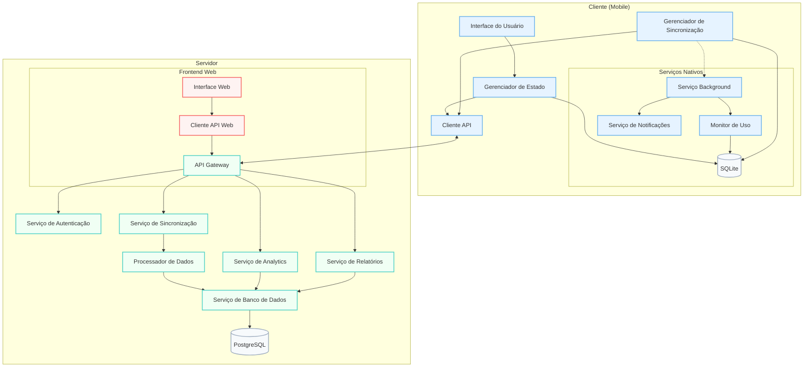
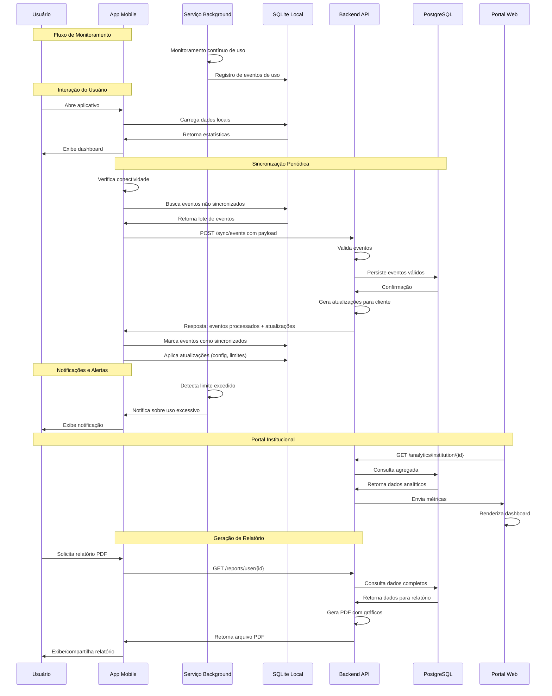
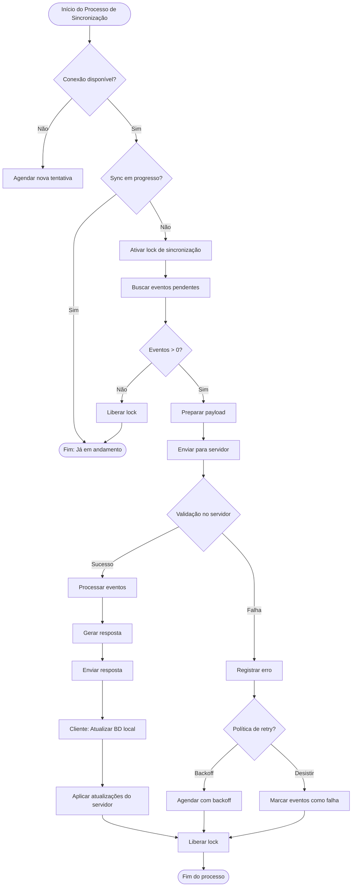
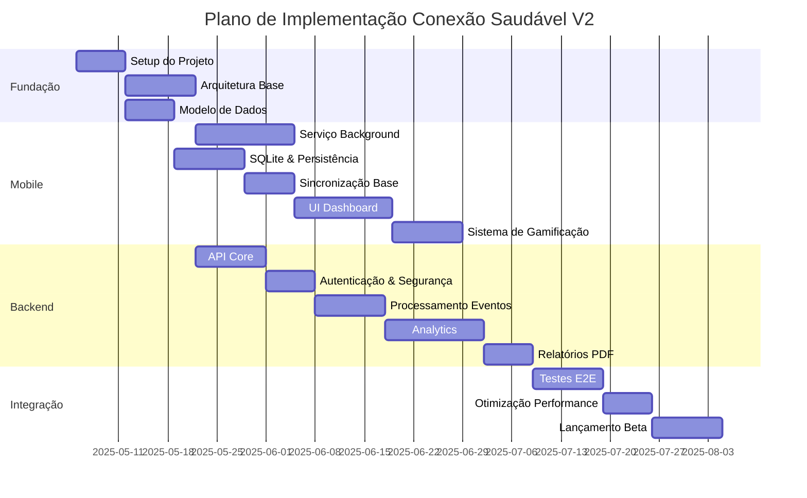

# DOCUMENTO DE ESPECIFICAÇÃO TÉCNICA
# Conexão Saudável V2.0

## Sumário
1. [Stack Tecnológico](#1-stack-tecnológico)
2. [Arquitetura do Sistema](#2-arquitetura-do-sistema)
3. [Componentes do Aplicativo Mobile](#3-componentes-do-aplicativo-mobile)
4. [Componentes do Backend](#4-componentes-do-backend)
5. [Mecanismos de Sincronização](#5-mecanismos-de-sincronização)
6. [Considerações de Performance](#6-considerações-de-performance)
7. [Segurança e Privacidade](#7-segurança-e-privacidade)
8. [Desafios Técnicos e Mitigações](#8-desafios-técnicos-e-mitigações)
9. [Plano de Implementação](#9-plano-de-implementação)
10. [Métricas de Sucesso Técnico](#10-métricas-de-sucesso-técnico)

---

## 1. Stack Tecnológico

### 1.1 Frontend Mobile
- **Framework Principal**: React Native 0.72+ com TypeScript 5.0+
  - **Justificativa**: Permite desenvolvimento cross-platform mantendo desempenho próximo ao nativo, essencial para serviço em background
  - **Alternativas Consideradas**: Flutter (rejeitado por menor integração com APIs nativas específicas)

- **State Management**: Redux Toolkit ou Zustand
  - **Justificativa**: Gerenciamento de estado centralizado para sincronização entre componentes e persistência
  - **Alternativas Consideradas**: Context API (limitação com estados complexos), MobX (overhead para caso de uso)

- **Banco de Dados Local**: SQLite via `react-native-sqlite-storage`
  - **Justificativa**: Armazenamento estruturado e relacional, suporte a transações
  - **Alternativas Consideradas**: Realm (licenciamento), AsyncStorage (não estruturado)

- **Módulos Nativos Essenciais**:
  - `react-native-background-fetch`: Execução periódica em background
  - `react-native-device-info`: Identificação do dispositivo
  - `react-native-notifications`: Sistema de notificações locais
  - Módulos nativos customizados para monitoramento de uso

- **UI/UX**:
  - React Native Paper ou Native Base: Componentes UI consistentes
  - `react-native-svg`: Gráficos e visualizações
  - `react-native-reanimated`: Animações fluidas para feedback visual

### 1.2 Backend
- **Framework API**: Node.js + Express + TypeScript
  - **Justificativa**: Velocidade de desenvolvimento e consistência de linguagem com frontend
  - **Alternativas Consideradas**: NestJS (overhead para caso de uso), Fastify (biblioteca de plugins limitada)

- **Banco de Dados**: PostgreSQL 14+
  - **Justificativa**: Recursos avançados de consulta para relatórios, extensibilidade e integridade
  - **Alternativas Consideradas**: MongoDB (menos adequado para dados estruturados e relacionais)

- **ORM**: TypeORM ou Prisma
  - **Justificativa**: Type-safety, migrations automáticas, integração com TypeScript
  - **Alternativas Consideradas**: Knex (menos recursos), Sequelize (tipagem menos robusta)

- **Geração de Relatórios**: PDFKit + node-canvas
  - **Justificativa**: Geração programática de PDFs com gráficos
  - **Alternativas Consideradas**: Puppeteer (mais pesado para implementação serverless)

- **Autenticação**: JWT + bcrypt
  - **Justificativa**: Stateless, facilidade de escala horizontal
  - **Alternativas Consideradas**: Sessions (estado no servidor, complexidade de escala)

### 1.3 DevOps e Infraestrutura
- **CI/CD**: GitHub Actions ou GitLab CI
  - **Justificativa**: Integração direta com repositório, pipeline customizável
  - **Alternativas Consideradas**: Jenkins (overhead de manutenção)

- **Deployment**: Docker + Kubernetes
  - **Justificativa**: Containerização para consistência ambiente-a-ambiente
  - **Alternativas Consideradas**: Serverless (limitações para processamento contínuo)

- **Monitoramento**: Prometheus + Grafana
  - **Justificativa**: Monitoramento em tempo real e alertas
  - **Alternativas Consideradas**: ELK Stack (mais complexo para configuração inicial)

---

## 2. Arquitetura do Sistema

### 2.1 Visão Geral da Arquitetura

O sistema segue uma arquitetura cliente-servidor distribuída com componentes móveis que funcionam offline e componentes de servidor que processam dados agregados e fornecem analytics.

#### Diagrama de Arquitetura de Alto Nível



### 2.2 Fluxos de Dados Principais

#### Diagrama de Fluxo de Dados - Monitoramento e Sincronização



---

## 3. Componentes do Aplicativo Mobile

### 3.1 Serviço em Background

Este é um dos componentes mais críticos e tecnicamente desafiadores do sistema.

#### Android Implementation
```typescript
// Native Module - UsageStatsModule.java
@ReactModule(name = "UsageStatsModule")
public class UsageStatsModule extends ReactContextBaseJavaModule {
    @ReactMethod
    public void startMonitoring() {
        // Iniciar serviço foreground com notificação persistente
        Intent serviceIntent = new Intent(getReactApplicationContext(), UsageMonitoringService.class);
        getReactApplicationContext().startForegroundService(serviceIntent);
    }
    
    // Implementação do acesso ao UsageStatsManager
}

// Bridge para React Native
// UsageStats.ts
import { NativeModules } from 'react-native';
const { UsageStatsModule } = NativeModules;

export const UsageStats = {
  startMonitoring: () => UsageStatsModule.startMonitoring(),
  // Outros métodos expostos
};
```

#### Considerações Críticas:
- **Android**: Requer permissão `PACKAGE_USAGE_STATS` que é considerada "especial" e exige aprovação explícita do usuário via configurações do sistema

### 3.2 Banco de Dados Local

```typescript
// src/database/schema.ts
export const DATABASE_VERSION = 1;

export const TABLES = {
  APP_USAGE: 'app_usage',
  USER_SETTINGS: 'user_settings',
  SYNC_LOG: 'sync_log',
  QUESTIONNAIRE_RESPONSES: 'questionnaire_responses',
};

export const createTables = async (db: SQLiteDatabase): Promise<void> => {
  // Tabela de uso de aplicativos
  await db.executeSql(`
    CREATE TABLE IF NOT EXISTS ${TABLES.APP_USAGE} (
      id TEXT PRIMARY KEY,
      package_name TEXT NOT NULL,
      start_time INTEGER NOT NULL,
      end_time INTEGER,
      duration INTEGER,
      synced INTEGER DEFAULT 0,
      sync_id TEXT,
      created_at INTEGER NOT NULL
    );
  `);
  
  // Outras tabelas...
};
```

### 3.3 Sistema de Sincronização

```typescript
// src/services/sync/syncService.ts
export class SyncService {
  private db: DatabaseService;
  private api: ApiService;
  private networkMonitor: NetworkMonitor;
  private syncInProgress = false;
  
  constructor(db: DatabaseService, api: ApiService, networkMonitor: NetworkMonitor) {
    this.db = db;
    this.api = api;
    this.networkMonitor = networkMonitor;
  }
  
  async syncIfPossible(): Promise<SyncResult> {
    if (this.syncInProgress) {
      return { status: 'in_progress' };
    }
    
    if (!await this.networkMonitor.isConnected()) {
      return { status: 'offline' };
    }
    
    try {
      this.syncInProgress = true;
      
      // 1. Buscar eventos não sincronizados
      const events = await this.db.getUnsyncedEvents(MAX_BATCH_SIZE);
      
      if (events.length === 0) {
        return { status: 'no_data' };
      }
      
      // 2. Enviar para o servidor
      const response = await this.api.sync('/sync/events', {
        events,
        device_id: await getDeviceId(),
        app_version: getAppVersion(),
        timestamp: Date.now()
      });
      
      // 3. Processar resposta
      await this.processServerResponse(response, events);
      
      return { 
        status: 'success',
        syncedCount: events.length
      };
    } catch (error) {
      await this.logSyncError(error);
      return {
        status: 'error',
        error
      };
    } finally {
      this.syncInProgress = false;
    }
  }
  
  private async processServerResponse(response: SyncResponse, events: AppUsageEvent[]): Promise<void> {
    // Implementação da lógica de processamento e reconciliação
  }
}
```

### 3.4 Interface do Usuário

O design da interface seguirá princípios de gamificação leve com componentes visuais de progresso:

```typescript
// src/screens/Dashboard.tsx
import React, { useEffect, useState } from 'react';
import { View, StyleSheet } from 'react-native';
import { ProgressChart, UsageBreakdown, AchievementFeed } from '../components';
import { useUsageStats, useAchievements } from '../hooks';
import { AppMetrics } from '../types';

export const DashboardScreen: React.FC = () => {
  const { todayStats, weeklyStats, isLoading } = useUsageStats();
  const { achievements, streaks } = useAchievements();
  
  return (
    <View style={styles.container}>
      <ProgressChart 
        data={todayStats}
        targetUsage={todayStats?.targetUsage}
        isLoading={isLoading}
      />
      
      <UsageBreakdown 
        appUsage={todayStats?.appBreakdown || []}
        isLoading={isLoading}
      />
      
      <AchievementFeed
        achievements={achievements}
        streaks={streaks}
      />
    </View>
  );
};
```

---

## 4. Componentes do Backend

### 4.1 Modelo de Dados

```typescript
// src/entities/AppUsage.entity.ts
@Entity('app_usage')
export class AppUsage {
  @PrimaryGeneratedColumn('uuid')
  id: string;
  
  @Column()
  user_id: string;
  
  @Column()
  device_id: string;
  
  @Column()
  package_name: string;
  
  @Column('text', { nullable: true })
  app_name: string;
  
  @Column('timestamp')
  start_time: Date;
  
  @Column('timestamp', { nullable: true })
  end_time: Date;
  
  @Column('int', { nullable: true })
  duration_seconds: number;
  
  @Column('jsonb', { nullable: true })
  metadata: Record<string, any>;
  
  @CreateDateColumn()
  created_at: Date;
  
  @UpdateDateColumn()
  updated_at: Date;
  
  @ManyToOne(() => User)
  user: User;
}
```

### 4.2 API de Sincronização

```typescript
// src/controllers/sync.controller.ts
@Controller('sync')
export class SyncController {
  constructor(
    private syncService: SyncService,
    private userService: UserService,
  ) {}
  
  @Post('events')
  @UseGuards(AuthGuard)
  async syncEvents(@Body() payload: SyncEventsDto, @Req() req: Request): Promise<SyncResponseDto> {
    const userId = req.user.id;
    const { events, device_id, timestamp } = payload;
    
    // Validar payload
    if (!events || !events.length) {
      throw new BadRequestException('No events provided');
    }
    
    // Processar eventos
    const result = await this.syncService.processEvents(userId, events, device_id);
    
    // Buscar atualizações para o cliente
    const updates = await this.userService.getPendingUpdates(userId, device_id, timestamp);
    
    return {
      success: true,
      sync_id: result.syncId,
      processed_count: result.processedCount,
      updates
    };
  }
}
```

### 4.3 Geração de Relatórios

```typescript
// src/services/report.service.ts
@Injectable()
export class ReportService {
  constructor(
    private usageRepository: UsageRepository,
    private configService: ConfigService,
  ) {}
  
  async generateUserReport(userId: string, options: ReportOptions): Promise<Buffer> {
    // 1. Buscar dados do usuário
    const userData = await this.usageRepository.getUserMetrics(userId, options.startDate, options.endDate);
    
    // 2. Criar documento PDF
    const doc = new PDFDocument();
    const buffers: Buffer[] = [];
    
    doc.on('data', buffers.push.bind(buffers));
    
    // 3. Adicionar cabeçalho e metadados
    this.addReportHeader(doc, userData.user, options);
    
    // 4. Adicionar gráficos e estatísticas
    await this.addUsageTrends(doc, userData.trends);
    await this.addAppBreakdown(doc, userData.appBreakdown);
    
    // 5. Adicionar recomendações personalizadas
    await this.addPersonalizedInsights(doc, userData);
    
    // 6. Finalizar o documento
    doc.end();
    
    return Buffer.concat(buffers);
  }
  
  private async addUsageTrends(doc: PDFKit.PDFDocument, trends: UsageTrend[]): Promise<void> {
    // Implementação da geração de gráfico de tendências
    const canvas = createCanvas(500, 250);
    const ctx = canvas.getContext('2d');
    
    // Desenhar gráfico usando node-canvas
    // ...
    
    // Adicionar ao PDF
    doc.image(canvas.toBuffer(), {
      fit: [500, 250],
      align: 'center',
    });
  }
  
  // Outros métodos privados para construção do relatório
}
```

### 4.4 Calibração de Limites

```typescript
// src/services/calibration.service.ts
@Injectable()
export class CalibrationService {
  constructor(
    private usageRepository: UsageRepository,
    private userRepository: UserRepository,
  ) {}
  
  async calibrateUserLimits(userId: string): Promise<CalibrationResult> {
    // 1. Obter perfil e histórico do usuário
    const user = await this.userRepository.findById(userId);
    const usageHistory = await this.usageRepository.getUserHistoricalUsage(userId, 30); // últimos 30 dias
    
    // 2. Determinar baseline com base no uso médio
    const baselineUsage = this.calculateBaseline(usageHistory);
    
    // 3. Aplicar regras por faixa etária
    let targetUsage = this.applyAgeRules(baselineUsage, user.age);
    
    // 4. Ajustar com base em desvios históricos
    targetUsage = this.adjustForHistoricalTrends(targetUsage, usageHistory);
    
    // 5. Garantir limites mínimos e máximos
    targetUsage = this.enforceMinMaxLimits(targetUsage, user.userType);
    
    // 6. Salvar nova configuração
    await this.userRepository.updateUserLimits(userId, targetUsage);
    
    return {
      previousLimit: user.dailyLimit,
      newLimit: targetUsage,
      adjustmentRatio: targetUsage / user.dailyLimit,
    };
  }
  
  private calculateBaseline(history: UsageHistory[]): number {
    // Implementação do cálculo da linha de base
  }
  
  private applyAgeRules(baseline: number, age: number): number {
    // Implementação das regras por faixa etária
  }
  
  // Outros métodos privados para calibração
}
```

---

## 5. Mecanismos de Sincronização

### 5.1 Estratégia de Sincronização

A sincronização é um componente crítico do sistema, especialmente considerando os requisitos de trabalhar offline e sincronizar rapidamente quando há conexão disponível.

#### Diagrama do Processo de Sincronização Detalhado



### 5.2 Resolução de Conflitos

A estratégia de resolução de conflitos é baseada em timestamps e priorização de servidor:

```typescript
// Exemplo da lógica de resolução no cliente
async resolveConflicts(localEvents: EventRecord[], serverUpdates: ServerUpdate[]): Promise<ResolvedChanges> {
  const resolved: ResolvedChanges = {
    accepted: [],
    rejected: [],
    merged: []
  };
  
  // Para cada item com mesmo ID em ambos os lados
  for (const localEvent of localEvents) {
    const serverVersion = serverUpdates.find(s => s.id === localEvent.id);
    
    if (!serverVersion) {
      // Não há conflito, o servidor não tem este registro
      resolved.accepted.push(localEvent);
      continue;
    }
    
    // Se o servidor tem uma versão mais recente, ela tem precedência
    if (serverVersion.updated_at > localEvent.updated_at) {
      resolved.rejected.push({ 
        local: localEvent, 
        server: serverVersion,
        reason: 'SERVER_NEWER'
      });
      continue;
    }
    
    // Se as alterações forem em campos diferentes, tenta mesclar
    if (this.canMergeChanges(localEvent, serverVersion)) {
      const merged = this.mergeChanges(localEvent, serverVersion);
      resolved.merged.push({
        original: localEvent,
        server: serverVersion,
        result: merged
      });
      continue;
    }
    
    // Em caso de dúvida, o servidor tem precedência
    resolved.rejected.push({
      local: localEvent,
      server: serverVersion,
      reason: 'CONFLICT_DETECTED'
    });
  }
  
  return resolved;
}
```

---

## 6. Considerações de Performance

### 6.1 Otimização Mobile

- **Monitoramento em Background**: O monitoramento contínuo consome bateria significativa. Estratégias:
  - Uso de `JobScheduler`/`WorkManager` no Android para agendamentos inteligentes
  - Redução de frequência de polling quando bateria está baixa
  - Lotes (batch) de eventos em vez de sincronização contínua

- **Armazenamento Eficiente**:
  - Índices otimizados no SQLite para consultas frequentes
  - Compressão de dados históricos
  - Limpeza periódica de dados já sincronizados e antigos

### 6.2 Otimização Backend

- **Throughput de Sincronização**:
  - Implementação de filas com RabbitMQ/Redis para processamento assíncrono
  - Sharding por usuário/instituição para escala horizontal
  - Cache de configurações frequentemente acessadas

- **Geração de Relatórios**:
  - Pre-agregação de dados para relatórios comuns
  - Geração assíncrona com notificação quando pronto
  - Limitação de período para relatórios detalhados

---

## 7. Segurança e Privacidade

### 7.1 Proteção de Dados

- **Armazenamento Seguro**:
  - Criptografia em repouso para banco de dados SQLite
  - Dados pessoais hash/anonimizados quando apropriado
  - Política de retenção clara com limpeza automática

- **Transmissão Segura**:
  - TLS/SSL para todas as comunicações
  - Certificado pinning no cliente mobile
  - Compressão e tokenização de payloads

### 7.2 Autenticação e Autorização

- **Autenticação Robusta**:
  - JWT com rotação frequente
  - Refresh tokens com invalidação em cascata
  - Múltiplos fatores para acessos institucionais

- **Modelo de Permissões**:
  - Granularidade por recurso e ação
  - Segregação estrita entre dados institucionais
  - Auditoria completa de acesso admin

---

## 8. Desafios Técnicos e Mitigações

### 8.1 Desafios no Cliente Mobile

| Desafio | Impacto | Estratégia de Mitigação |
|---------|---------|-------------------------|
| Restrições de background em iOS | Alto | Foco em notificações programadas e engajamento ativo; métricas alternativas de uso |
| Consumo de bateria em Android | Médio | Algoritmo adaptativo de monitoramento; redução dinâmica de frequência |
| Permissões de acesso a estatísticas | Alto | Fluxo de onboarding detalhado; explicação clara dos benefícios |
| Sincronização inconsistente | Médio | Mecanismo de retry com backoff exponencial; verificação de integridade |
| Fragmentação Android | Médio | Testes em diferentes versões Android; detecção de capabilities |

### 8.2 Desafios no Backend

| Desafio | Impacto | Estratégia de Mitigação |
|---------|---------|-------------------------|
| Picos de sincronização | Alto | Sistema de filas; auto-scaling; throttling por cliente |
| Geração rápida de relatórios | Médio | Pre-agregação; cache de relatórios comuns; filas de prioridade |
| Escala de armazenamento | Baixo | Particionamento por data; compressão; arquivamento |
| Consistência entre dispositivos | Médio | Resolução determinística de conflitos; versioning de dados |
| Carga de análises em tempo real | Alto | Processamento em streaming; análises incrementais |

### 8.3 Riscos de Implementação

| Risco | Probabilidade | Impacto | Estratégia |
|-------|--------------|---------|------------|
| Rejeição na App Store | Média | Crítico | Preparar alternativas para monitoramento iOS; documentação clara para review |
| Falhas em serviço background | Alta | Alto | Mecanismos de auto-recuperação; fallback para monitoramento simples |
| Inconsistências de dados | Média | Alto | Validação rigorosa; reconciliação periódica completa |
| Sobrecarga de servidor | Baixa | Alto | Throttling por cliente; circuit breakers; escalabilidade horizontal |
| Problemas de privacidade | Média | Crítico | Revisão legal do processo; anonimização onde possível |

---

## 9. Plano de Implementação

### 9.1 Fases do Desenvolvimento



### 9.2 Estratégia de Implementação por Componente

#### Mobile App (React Native + TypeScript)

1. **Estrutura Inicial**
   - Configurar projeto com TypeScript, ESLint, Prettier
   - Implementar navegação básica (React Navigation)
   - Configurar Redux Toolkit/Zustand para gerenciamento de estado

2. **Camada de Persistência**
   - Implementar abstração SQLite com migrations
   - Desenvolver DAOs para cada entidade principal
   - Criar sistema de cache para consultas frequentes

3. **Serviço Background**
   - Desenvolver módulos nativos para Android/iOS
   - Implementar lógica de monitoramento com fallbacks
   - Testar em diferentes versões de SO e fabricantes

4. **Sistema de Sincronização**
   - Desenvolver cliente de API com retry e offline support
   - Implementar lógica de reconciliação e resolução de conflitos
   - Adicionar compressão e batching de dados

5. **Interface do Usuário**
   - Implementar componentes de feedback visual
   - Desenvolver visualizações de dados e gráficos
   - Criar componentes de gamificação e notificação

#### Backend (Express + TypeScript + PostgreSQL)

1. **Estrutura Base**
   - Configurar projeto Express com TypeScript
   - Implementar arquitetura de camadas (controller, service, repository)
   - Configurar ORM e conexão com PostgreSQL

2. **Autenticação e Autorização**
   - Implementar sistema JWT com refresh tokens
   - Desenvolver middleware de autorização granular
   - Adicionar rate limiting e proteções de segurança

3. **API de Sincronização**
   - Implementar endpoints para receber eventos em batch
   - Desenvolver lógica de validação e persistência
   - Criar sistema de notificação para clientes

4. **Motor Analítico**
   - Implementar queries de agregação
   - Desenvolver lógica de calibração dinâmica
   - Criar cache para cálculos pesados

5. **Geração de Relatórios**
   - Implementar serviço de geração de PDF
   - Desenvolver templates personalizáveis
   - Otimizar performance de geração


### 9.3. Diagrama de implementação

```mermaid
flowchart TB
    subgraph "Mobile App (React Native + TypeScript)"
        subgraph "UI Layer"
            ReactComponents["Componentes React"]
            Navigation["Navegação"]
            Screens["Telas"]
        end
        
        subgraph "State Management"
            ReduxStore["Redux Store"]
            Actions["Actions"]
            Reducers["Reducers"]
            Selectors["Selectors"]
        end
        
        subgraph "Services"
            ApiService["API Service"]
            BackgroundService["Background Service"]
            SyncService["Sync Service"]
            NotificationService["Notification Service"]
            StorageService["Storage Service"]
        end
        
        subgraph "Native Modules"
            UsageTracker["Usage Tracker (Native)"]
            SQLiteAdapter["SQLite Adapter"]
            NotificationAdapter["Notification Adapter"]
        end
        
        subgraph "Data Layer"
            Models["Modelos de Dados"]
            DAO["Data Access Objects"]
            ORM["SQLite ORM"]
        end
        
        ReactComponents --> Navigation
        Navigation --> Screens
        Screens --> Actions
        Actions --> ReduxStore
        ReduxStore --> Selectors
        Selectors --> ReactComponents
        ReduxStore --> Reducers
        
        ApiService --> Actions
        Screens --> ApiService
        BackgroundService --> UsageTracker
        BackgroundService --> NotificationAdapter
        SyncService --> ApiService
        SyncService --> StorageService
        StorageService --> SQLiteAdapter
        SQLiteAdapter --> ORM
        ORM --> DAO
        DAO --> Models
    end
    
    subgraph "Backend (Express + TypeScript)"
        subgraph "API Layer"
            Routes["Rotas Express"]
            Controllers["Controllers"]
            Middleware["Middlewares"]
            DTOs["DTOs/Validators"]
        end
        
        subgraph "Business Layer"
            Services["Services"]
            DomainModels["Domain Models"]
            ConfigEngine["Engine de Configuração"]
            PdfGenerator["PDF Generator"]
            AnalyticsEngine["Analytics Engine"]
        end
        
        subgraph "Data Access Layer"
            Repositories["Repositories"]
            Entities["Entities"]
            QueryBuilder["Query Builder"]
            TypeORM["TypeORM"]
        end
        
        Routes --> Controllers
        Routes --> Middleware
        Controllers --> DTOs
        Controllers --> Services
        Services --> DomainModels
        Services --> ConfigEngine
        Services --> PdfGenerator
        Services --> AnalyticsEngine
        Services --> Repositories
        Repositories --> Entities
        Repositories --> QueryBuilder
        QueryBuilder --> TypeORM
    end
    
    subgraph "DevOps & Infrastructure"
        subgraph "CI/CD"
            GitHubActions["GitHub Actions"]
            Tests["Testes Automatizados"]
            CodeAnalysis["Análise de Código"]
            BuildSystem["Sistema de Build"]
        end
        
        subgraph "Deployment"
            DockerContainers["Containers Docker"]
            Kubernetes["Kubernetes"]
            CloudServices["Serviços em Nuvem"]
        end
        
        subgraph "Monitoring"
            APM["Application Performance Monitoring"]
            LogAggregation["Agregação de Logs"]
            Alerts["Sistema de Alertas"]
        end
        
        GitHubActions --> Tests
        GitHubActions --> CodeAnalysis
        GitHubActions --> BuildSystem
        BuildSystem --> DockerContainers
        DockerContainers --> Kubernetes
        Kubernetes --> CloudServices
        CloudServices --> APM
        APM --> LogAggregation
        LogAggregation --> Alerts
    end
    
    ApiService --> Routes
    
    classDef ui fill:#e1bee7,stroke:#8e24aa
    classDef state fill:#bbdefb,stroke:#1976d2
    classDef services fill:#c8e6c9,stroke:#388e3c
    classDef native fill:#ffcdd2,stroke:#d32f2f
    classDef data fill:#fff9c4,stroke:#fbc02d
    
    classDef api fill:#b2dfdb,stroke:#00796b
    classDef business fill:#ffe0b2,stroke:#fb8c00
    classDef dataAccess fill:#d7ccc8,stroke:#5d4037
    
    classDef devops fill:#d1c4e9,stroke:#512da8
    
    class ReactComponents,Navigation,Screens ui
    class ReduxStore,Actions,Reducers,Selectors state
    class ApiService,BackgroundService,SyncService,NotificationService,StorageService services
    class UsageTracker,SQLiteAdapter,NotificationAdapter native
    class Models,DAO,ORM data
    
    class Routes,Controllers,Middleware,DTOs api
    class Services,DomainModels,ConfigEngine,PdfGenerator,AnalyticsEngine business
    class Repositories,Entities,QueryBuilder,TypeORM dataAccess
    
    class GitHubActions,Tests,CodeAnalysis,BuildSystem,DockerContainers,Kubernetes,CloudServices,APM,LogAggregation,Alerts devops
```


