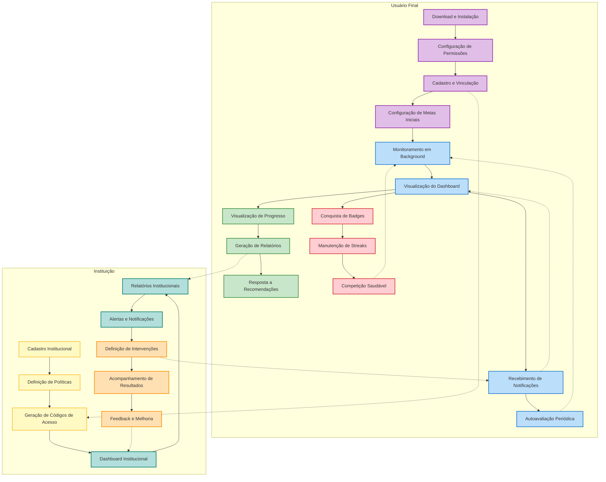
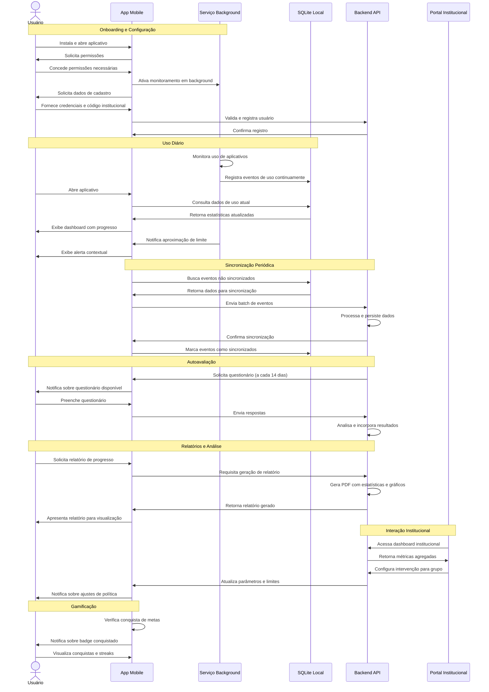

Tags: [[Conexão Saudável]], [[Conexão Saudável - Proposta para Versão 2.0]]

==Em anexos existem dois diagramas descrevendo o funcionamento do APP:==
- [Anexos](#anexos)
# Fluxos de Usuário para o Conexão Saudável V2.0

## Fluxo do Usuário Final (Agente Principal)

### 1. Onboarding e Configuração Inicial

1. **Download e Instalação**
    - Usuário baixa o aplicativo da loja (App Store/Google Play)
    - Abre o app pela primeira vez
2. **Configuração de Permissões**
    - Recebe explicação clara sobre permissões necessárias
    - Concede permissão para monitoramento de uso (especialmente crítico no Android)
    - Autoriza notificações e serviço em background
3. **Cadastro e Vinculação**
    - Cria conta ou faz login com credenciais institucionais
    - Vincula-se à instituição (escola, universidade, empresa) usando código específico
    - Seleciona perfil (estudante, profissional, etc.)
4. **Configuração de Metas Iniciais**
    - Visualiza limites de uso recomendados pelo sistema
    - Pode ajustar metas iniciais (que serão refinadas pelo algoritmo de calibração)
    - Confirma entendimento do sistema de gamificação

### 2. Uso Diário

1. **Monitoramento Passivo**
    - O serviço em background registra uso de aplicativos continuamente
    - Dados são armazenados localmente em SQLite
2. **Visualização de Dashboard**
    - Abre o aplicativo para verificar estatísticas de uso
    - Visualiza gráfico de progresso diário em relação à meta
    - Acessa breakdown de uso por categorias de aplicativos
    - Verifica feed de conquistas e streaks
3. **Recebimento de Notificações**
    - Recebe alertas quando se aproxima do limite de uso
    - Obtém notificações positivas ao atingir metas ou conquistar badges
    - É notificado sobre calibrações periódicas de limites
4. **Autoavaliação Periódica**
    - A cada 14 dias, recebe notificação para questionário
    - Responde perguntas sobre percepção de uso e bem-estar
    - Visualiza resultados comparativos com períodos anteriores

### 3. Interação com Relatórios

1. **Visualização de Progresso**
    - Acessa seção "Meu Progresso" no aplicativo
    - Visualiza tendências de uso semanal e mensal
    - Compara padrões atuais com histórico pessoal
2. **Geração de Relatórios**
    - Solicita geração de relatório PDF completo
    - Personaliza período e métricas do relatório
    - Baixa, visualiza e compartilha documento gerado
3. **Resposta a Recomendações**
    - Recebe sugestões personalizadas baseadas em padrões de uso
    - Opta por aceitar ajustes recomendados de metas
    - Visualiza impacto projetado das alterações

### 4. Gamificação e Engajamento

1. **Conquista de Badges**
    - Completa desafios como "Semana Equilibrada" ou "Foco Total"
    - Recebe notificações e animações comemorativas
    - Visualiza coleção de badges no perfil
2. **Manutenção de Streaks**
    - Acompanha sequências de dias atingindo metas
    - Recebe lembretes para manter streaks ativos
    - Recupera streaks com ações específicas
3. **Competição Saudável**
    - Visualiza ranking anônimo dentro de seu grupo institucional
    - Participa de desafios coletivos (opcional)
    - Recebe reconhecimento por melhoria contínua

## Fluxo da Instituição (Universidades e Empresas)

### 1. Configuração e Administração

1. **Cadastro Institucional**
    - Acessa portal web dedicado
    - Cria conta institucional com dados de verificação
    - Configura subgrupos (turmas, setores, departamentos)
    - Estabelece administradores e visualizadores
2. **Definição de Políticas**
    - Configura limites base por perfil de usuário
    - Estabelece parâmetros de calibração aceitáveis
    - Define frequência e tipo de relatórios automáticos
    - Configura regras para alertas institucionais
3. **Geração de Códigos de Acesso**
    - Cria códigos de convite para usuários
    - Agrupa códigos por setor/departamento/turma
    - Distribui códigos via canais institucionais

### 2. Monitoramento e Análise

1. **Dashboard Institucional**
    - Acessa painel de controle web
    - Visualiza métricas agregadas em tempo real
    - Filtra dados por grupos, períodos e métricas
    - Identifica tendências e outliers
2. **Relatórios Institucionais**
    - Acessa seção de relatórios
    - Configura parâmetros de geração
    - Obtém documentos PDF com dados agregados
    - Exporta dados para sistemas próprios (opcional)
3. **Alertas e Notificações**
    - Recebe alertas sobre padrões preocupantes
    - É notificado sobre tendências significativas
    - Visualiza resumos periódicos automáticos

### 3. Intervenção e Suporte

1. **Definição de Intervenções**
    - Identifica grupos que necessitam de atenção
    - Configura mensagens institucionais específicas
    - Ajusta limites para grupos específicos quando necessário
2. **Acompanhamento de Resultados**
    - Monitora impacto das intervenções
    - Compara métricas antes/depois de ajustes
    - Identifica práticas bem-sucedidas
3. **Feedback e Melhoria**
    - Acessa métricas de engajamento com o app
    - Analisa taxas de resposta aos questionários
    - Refina políticas com base em resultados

## Cenários de Uso Típicos

### Cenário 1: Estudante Universitário

Maria é estudante de engenharia e passa muito tempo usando aplicativos não acadêmicos durante períodos de aula.

1. Recebe notificação sobre aproximação do limite diário
2. Abre o app e visualiza que usou redes sociais por 2h45min durante horário de aula
3. Decide ativar modo foco por 2 horas para completar um trabalho
4. Recebe badge "Recuperação de Foco" ao final do dia
5. Na semana seguinte, vê no relatório a melhoria de 20% no uso consciente

### Cenário 2: Profissional em Empresa

Carlos trabalha em uma empresa que adotou o Conexão Saudável para melhorar bem-estar digital.

1. Durante reunião de equipe, compartilha relatório mostrando melhoria de produtividade
2. Nota que seu uso noturno de aplicativos está afetando sono (identificado no questionário)
3. Aceita recomendação para limite reduzido após 22h
4. Mantém streak de "Desconexão Noturna" por 10 dias
5. Recebe notificação de calibração: sistema ajusta limites baseado em seu novo padrão

### Cenário 3: Coordenador de Curso

Professora Ana é coordenadora de um curso universitário:

1. Acessa dashboard institucional e identifica aumento de uso durante período de provas
2. Gera relatório comparativo entre turmas de diferentes semestres
3. Configura mensagem institucional com dicas de gestão de tempo
4. Ajusta limites temporariamente durante semana de provas
5. Após período crítico, analisa impacto das intervenções nas métricas de desempenho

## Anexos:

### **Diagrama de Fluxo de usuário:**

### **Diagrama de interação com o app:**

