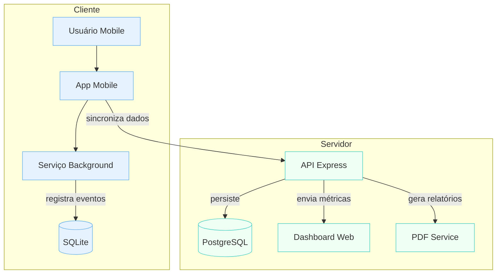

Tags: [[Conexão Saudável]]
## 1. Contexto e Necessidade

Uso excessivo de dispositivos móveis compromete desempenho acadêmico e profissional e está associado a aumento de ansiedade e isolamento. Instituições — escolas, universidades e empresas — carecem de métricas confiáveis para estabelecer políticas de uso saudável. Solução atual apresenta:

- Interface de bloqueio genérica com baixo engajamento
- Falta de indicadores relevantes para análise institucional
- Diário reflexivo subutilizado no fluxo principal
- Ausência de clareza sobre papel da universidade nas interações

## 2. Diferenças entre Versões

1. **Coleta de eventos**: de batch sem offline → serviço nativo em background com fallback em SQLite.
2. **Experiência do usuário**: bloqueio estático → gatilhos visuais e gamificação leve.
3. **Relatórios**: inexistentes → exportação PDF e painel institucional.
4. **Limites de uso**: fixos → motor de calibração dinâmico por perfil.
5. **Autoavaliação**: manual no diário → questionário programado.

## 3. Novo Core da Aplicação

1. **Coleta de Dados**: monitoramento nativo de abertura, fechamento e bloqueio de apps.
2. **Sincronização Offline/Online**: armazenamento local em SQLite; reconciliação automática sem perda de dados.
3. **Autoavaliação Periódica**: questionário validado disparado a cada 14 dias; resultados enviados ao servidor.
4. **Relatórios PDF**: geração rápida (<1s) de documentos configuráveis com gráficos e metas.
5. **Calibração de Limites**: regras ajustáveis por faixa etária; algoritmo usa desvio histórico para ajustes.
6. **Gamificação**: pontos, badges e streaks exibidos em feed de conquistas.

## 4. Agentes Diretos e Fluxo de Interação

- **Instituições**  
    • Cadastro via portal web personalizado (escolas, universidades ou empresas)  
    • Dashboard com indicadores agregados por turma, curso ou setor  
    • Configuração de políticas e alertas automáticos
- **Usuário Principal**  
    • Recebe notificações calibradas  
    • Preenche questionários de autoavaliação  
    • Visualiza progresso e recompensas  
    • Cumpre metas semanais e mensais

## 5. Diagrama de Contexto

## 6. Detalhamento das Funcionalidades

|Funcionalidade|Descrição|Critério de Sucesso|
|---|---|---|
|Coleta de Dados|Registro contínuo de uso e bloqueio de aplicativos|≥99% de eventos capturados sem falhas|
|Sincronização Offline/Online|Fallback em SQLite e reconciliação transparente|Tempo de reconciliação <2s, sem conflitos|
|Autoavaliação|Questionário disparado a cada 14 dias: respostas armazenadas|Taxa de resposta ≥75%|
|Relatórios em PDF|Geração de documentos configuráveis com gráficos de uso|Geração em <1s, legibilidade móvel e desktop|
|Calibração de Limites|Ajuste automático de limites por perfil e desvio histórico|Recalibração sem intervenção, variação ≤5%|
|Gamificação|Sistema de pontos, badges e streaks|Persistência de streaks correta em ≥95% das sessões|

## 7. Melhorias Futuras

1. Notificações adaptativas com escalonamento até bloqueio parcial
2. Internacionalização (i18n) com tradução dinâmica
3. Chat seguro com profissionais de suporte
4. API pública documentada (OpenAPI) para integração
5. Recomendação baseada em ML para ajustes de metas
6. Testes de performance com simulação de 10K usuários simultâneos

## 8. Critérios de Entrega

- Todos os critérios de sucesso das funcionalidades atendidos
- Documentação da API completa e cobertura de testes ≥85%
- SUS móvel ≥85
- Latência de resposta do backend <200 ms
- CI/CD estável em 5 execuções consecutivas

---

_Versão 2.0 pronta para revisão final e planejamento de release._